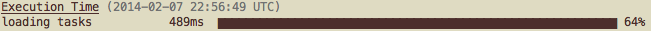

# grunt-lazyload

Gruntplugin Lazy Loading

_The Api has been changed to extend the grunt object, rather than provide a new wrapping object. For documentation on the old api (v0.2.2 and below) go here: [v0.2.2](https://github.com/raphaeleidus/grunt-lazyload/tree/v0.2.2)_

[](https://travis-ci.org/raphaeleidus/grunt-lazyload)
[](http://badge.fury.io/js/grunt-lazyload)
[](http://gruntjs.com/)
[](https://codeclimate.com/github/raphaeleidus/grunt-lazyload)

## Getting Started
Install the module with: `npm install grunt-lazyload --save`

```javascript
require('grunt-lazyload')(grunt);

grunt.lazyLoadNpmTasks('grunt-contrib-jshint', 'jshint');
```

## Documentation
Lazy loading npm tasks means making every grunt run noticibly faster. For one of my projects it shaves almost 400ms off every run. Which when you want to just concat the file, is noticable. Or when you are trying to make your deploys as fast as possible, 400ms here can help keep things snappy.

#### Before Lazy Loading

#### After Lazy Loading


_(Image captured with [time-grunt](https://github.com/sindresorhus/time-grunt))_

Another big win is if you are using grunt in conjunction with Jenkins to do your deploys. If you are lazy loading npm modules, modules that wont get triggered dont even need to be installed. So when jenkins starts running a job it runs `npm install --production` and only downloads the production dependencies and not the dev dependencies like `grunt-contrib-watch` for example. This means my `npm install` step during my deploys dropped from about 15 seconds to about 10. This was a big win for me and my team. Even when I have a full `node_modules` folder the check to see if anything needs updating dropped by 250ms by running `npm install --production`

Not everyone is using grunt the same way, but if you want your grunt to run a little bit faster, consider lazy loading.

## Examples
### Adding lazyloading to grunt:
```javascript
require('grunt-lazyload')(grunt);
```
This is not truely a gruntplugin but a node module that adds an extra method to grunt to allow lazy loading so you have to pass it an instance of grunt for it to modify

### Lazy loading a library with a single task:
```javascript
grunt.lazyLoadNpmTasks('grunt-contrib-jshint', 'jshint');
```

### Lazy loading a library with multiple tasks:
```javascript
grunt.lazyLoadNpmTasks('grunt-some-plugin', ['task1', 'task2', 'task3']);
```

You must provide the task names that the plugin will define ahead of time.

## Contributing
In lieu of a formal styleguide, take care to maintain the existing coding style. Add unit tests for any new or changed functionality. Lint and test your code using [Grunt](http://gruntjs.com/).

## Release History
* 5/10/2014  - 1.0.3 (eagerload for -h) - [PR#5](https://github.com/raphaeleidus/grunt-lazyload/pull/5)
* 2/17/2014  - 1.0.2 (jshint error cleanup - [PR#4](https://github.com/raphaeleidus/grunt-lazyload/pull/4)) 
* 2/4/2014   - 1.0.1 (eagerload for the --help screen)
* 2/4/2014   - 1.0.0 (simplify code and improve api)
* 2/3/2014   - 0.2.2 (fix multitarget/paramater passing bug)
* 5/14/2013  - 0.2.0 (use an init function to pass in the grunt object)
* 5/14/2013  - 0.1.0
* 5/10/2013  - 0.0.6 (gruntplugin keyword added to npm)
* 5/10/2013  - 0.0.4 (Better tests)
* 5/9/2013   - 0.0.2

## License
Copyright (c) 2013 Raphael Eidus
Licensed under the MIT license.
